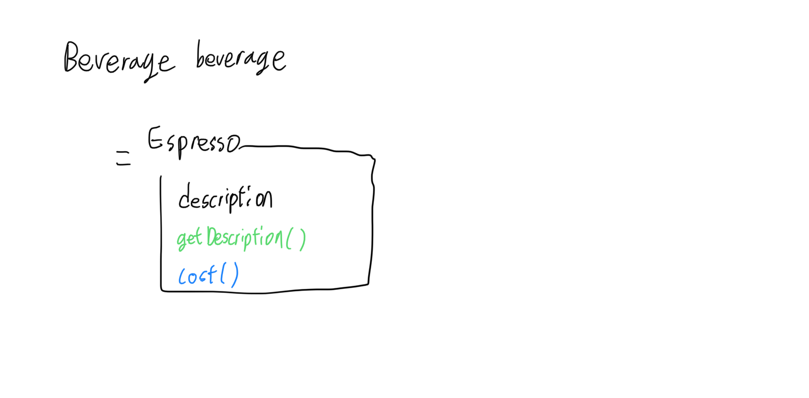
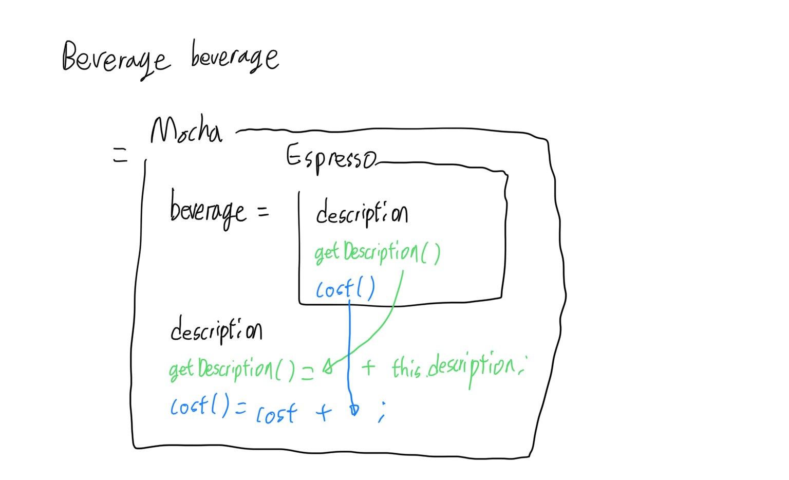

# Design Pattern - Decorator

## 주의

- TypeScript의 decorator와는 조금 다릅니다.

## Motivation

### Specification

- 커피 전문점의 메뉴 관리 솔루션.
- 음료는 base beverage(기본음료)에 n개의 condiment(재료)를 넣어 제작한다. (n >= 0)
- 음료에 투입되는 재료의 종류는 다양하며 추가될 수 있다.
- 재료의 가격은 변동될 수 있다.
- 같은 재료가 2개 이상 투입될 수 있다. 더블모카처럼.
- 기본음료와 투입된 재료의 cost(가격)을 모두 합산하여 음료의 가격을 계산해야 한다.
- 기본음료와 투입된 재료의 description(설명)을 모두 concat하여 음료의 설명을 구해야 한다.

### 목적

- 자잘한 속성의 차이로 exponetial하게 늘어나는 class의 수를 줄인다. (p.119)
- 그 자잘한 속성들의 정보가 바뀔 때 유연하게 대응한다. (p.120)
- 속성이 추가될 때 이미 있는 코드의 수정을 최소화한다.


## Decorator Pattern

- 속성과 행동을 덧붙인다. 재귀적으로.





```java
// Abstract class for beverage
public abstract class Beverage {
	String description = "";
	public String getDescription() { return description; }
	public abstract double cost();
}

// Class for beverage definition
public class Espresso extends Beverage {
	public Espresso() { description = "Espresso"; }
	public double cost() { return 1.99; }
}
// HouseBlend, DarkRoast, Decaf, ...

// Abstract decorator for condiments
public abstract class CondimentDecorator extends Beverage /*상속*/ {
	public abstract String getDescription();
}

// Decorator for condiments definition
public class Mocha extends CondimentDecorator {
	Beverage beverage;
	public Mocha(Beverage beverage) { this.beverage = beverage; };
	public String getDescription() { return beverage.getDescription() + ", Mocha"; /*덧붙임*/ }
	public double cost() { return .20 + beverage.cost(); }
}

// Main
public class Main {
	public static void main(String args[]) {
		Beverage espressoDoubleMocha = new Mocha(new Mocha(new Espresso()));
		System.out.println(espressoDoubleMocha.getDescription() + espressoDoubleMocha.cost());
	}
}
```


<!-- 
Recall: strategy pattern
```java
// 행동의 declare
public interface FlyBehavior {
	public void fly();
}

public interface QuackBehavior {
	public void quack();
}

// Fly 행동의 definition
public class FlyWithWings extends FlyBehavior {
	public void fly() {
		System.out.println("Fly!");
	}
}

public class FlyNoWay extends FlyBehavior {
	public void fly() {
		System.out.println("Can't fly...");
	}
}

// Quack 행동의 definition
public class Quack extends QuackBehavior {
	public void quack() {
		System.out.println("Quack!");
	}
}

public class MuteQuack extends QuackBehavior {
	public void fly() {
		System.out.println("Can't quack...");
	}
}

// 부모 class
public abstract Duck {
	private FlyBehavior flyBehavior;
	private QuackBehavior flyBehavior;
	public 
}
```
 -->


## 실제 적용 예시

- Java의 내장 API java.io

	- InputStream child class들의 constructor의 parameter로 InputStream을 받는다.


## 장단점 비교: 좋은 확장성, 부족한 유연성

### 장점

- OCP를 만족한다. (강력한 특성)

#### Open Closed Principle

- 확장에 대해서는 open, 변경에 대해서는 closed.
- 기존의 코드를 변경하지 않고도 확장할 수 있어야 한다.
- Decorator 패턴에서는 새로운 속성 definition 추가되더라도 base class를 변경할 필요가 없다.

### 단점

- 코드 구조가 복잡해진다.
	- 여전히 자잘한 class가 많고, class 구조를 단번에 이해하기 어렵다. (p.139)
	- 1번의 instantiation에 데코레이터를 많이 덧붙일 수록 코드가 복잡해진다. (p.141)
- 실행 코드의 관점에서 instance에 어떤 데코레이터가 적용되었는지 알기 어렵다.
	- 실행 코드가 instance의 형식(아마도 type 등)에 민감하다면 이 패턴을 적용하기 어렵다.
- Instance에 속성을 덧붙이는 것은 자유롭지만, runtime에서의 제거 및 변경에는 유연하지 않다.
	- Class define을 획기적으로 줄일 수 있으나, runtime 수준에서의 과도한 자유를 의도한 패턴이 아니다.

